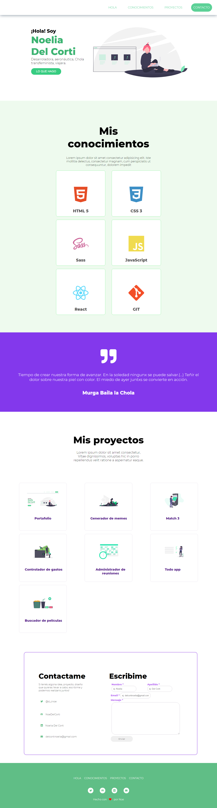

# Portafolio Noelia Del Corti

### Este portafolio es mi primer proyecto, desarrollado durante la cursada de Desarrollo FrontEnd en ADA (2020-2021).

 

### ¿Te gustaría ver como quedó? podes verlo en este [enlace](noedelcorti.github.io/portafolio/.) o también podes hacerlo desde acá [aca](https://amazing-jackson-ed6e70.netlify.app/).

 

### Si queres tener el código en tu computadora, seguí los siguentes pasos en tu terminal.

- Ir al repositorio [repositorio](https://github.com/NoeDelCorti/portafolio)
- Darle clik al botón de code.
- Copiar la url.
- Abrir tu terminal y poner el comando de
**git clone <url>**.
- Entrar a la carpeta del proyecto en tu IDE.

 

## Este proyecto no precisa de la instalación de ninguna dependencia, al momento...

 

### Esta es una de las vistas del proyecto desde una computadora, pero podes abrirlo desde cualquier dispositivo ya que es responsivo ;)

 

---

### Así debería ser el resultado final de tu instalación.

 

---
 
 

### Este portafolio fue desarrollado por Noe Del Corti, también conocida como Noe Delta Charly. Agradezco a mis amores mentorxs [Aman Cardoso](https://www.linkedin.com/in/amanda-cardoso-930657145/) y [Cou Infante](https://www.linkedin.com/in/cou-infante-08889032/) que me alentaron a iniciarme IT y me recomendaron [Ada](https://github.com/Ada-IT) para dar mis primeros pasos con amor. Gracias [Ada-IT](https://www.linkedin.com/school/ada-itw/) por la iniciativa tan necesaria de este espacio pensado para mujeres y femeneidades, con el fin de empoderarnos y disminuir la brecha de genero en el rubro. Gracias a [Leydy Moreno](https://github.com/leydyk93/) por tu buena predispocisión y tu amabilidad al explicar, y por ultimo pero no por eso menos importante, gracias a [Jonh Parra](https://github.com/Jonhks) por su empatía, su paciencia, su forma de enseñar aprendiendo y su buena onda!.

 

### Hecho con amor y desde el <3 por Noe.

